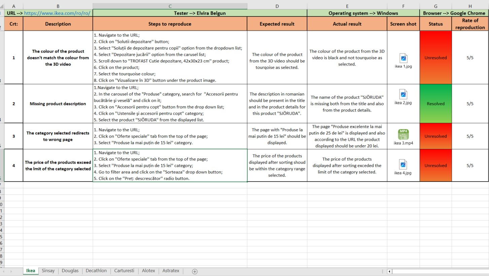
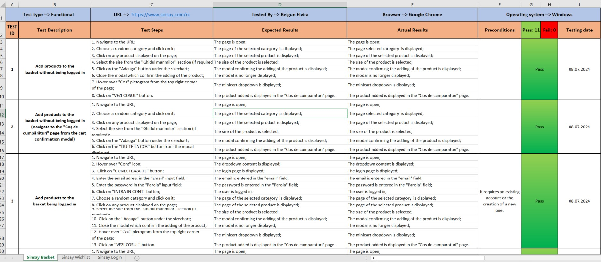

# Manual Testing Project
## Overview
This repository showcases my skills in manual testing through real-world examples of bug reports and test cases.
## Contents
1. **[Bug Reports](https://github.com/ElviraBelgun/Manual-Testing-Project/blob/main/Bug%20reports.xlsx)**: This Excel file contains a collection of real bug reports that I identified on various websites. Each report includes detailed descriptions, steps to reproduce, status, screenshot or screen recording and ate of reproduction.
2. **[Test Cases](https://github.com/ElviraBelgun/Manual-Testing-Project/blob/main/Test%20cases.xlsx)**: This Excel file includes test cases I created for a specific website. The test cases cover different scenarios.
## How to Use This Repository
### Review the Bug Reports:

- Download and open the [Bug Reports](https://github.com/ElviraBelgun/Manual-Testing-Project/blob/main/Bug%20reports.xlsx) file.
- Explore the various bugs identified, along with their descriptions, reproduction steps and screenshots or screen recordings.
### Examine the Test Cases:

- Download and open the [Test Cases](https://github.com/ElviraBelgun/Manual-Testing-Project/blob/main/Test%20cases.xlsx) file.
- Review the test cases designed for different functionalities of a web application, including the expected results and the status of each test.
Preview Screenshots:

### Below are some screenshots from the Excel files to give you a quick overview of their content:

